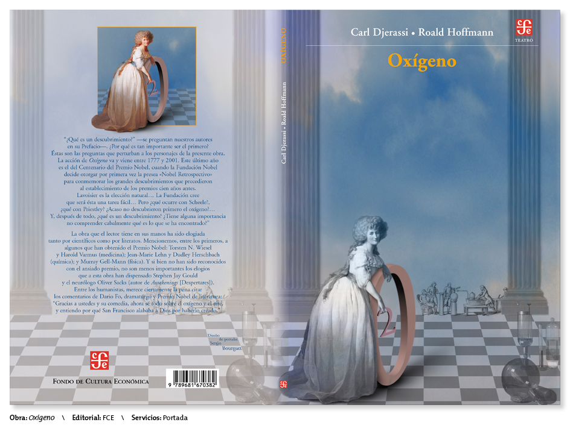
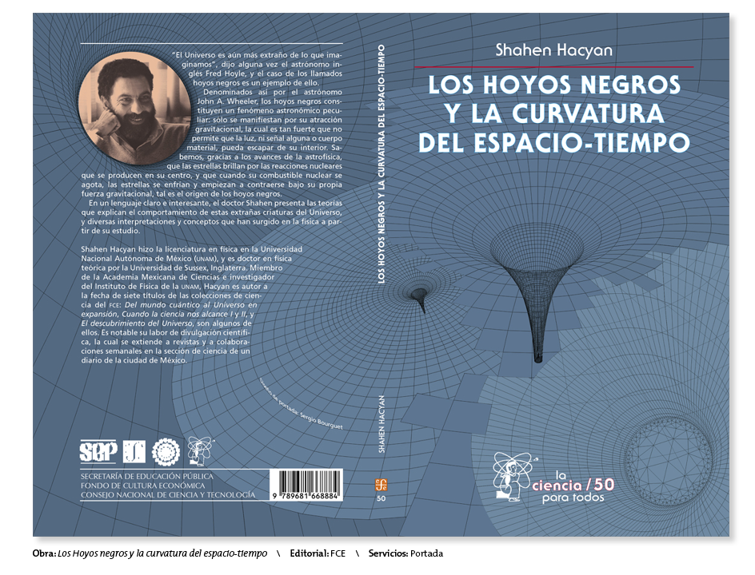
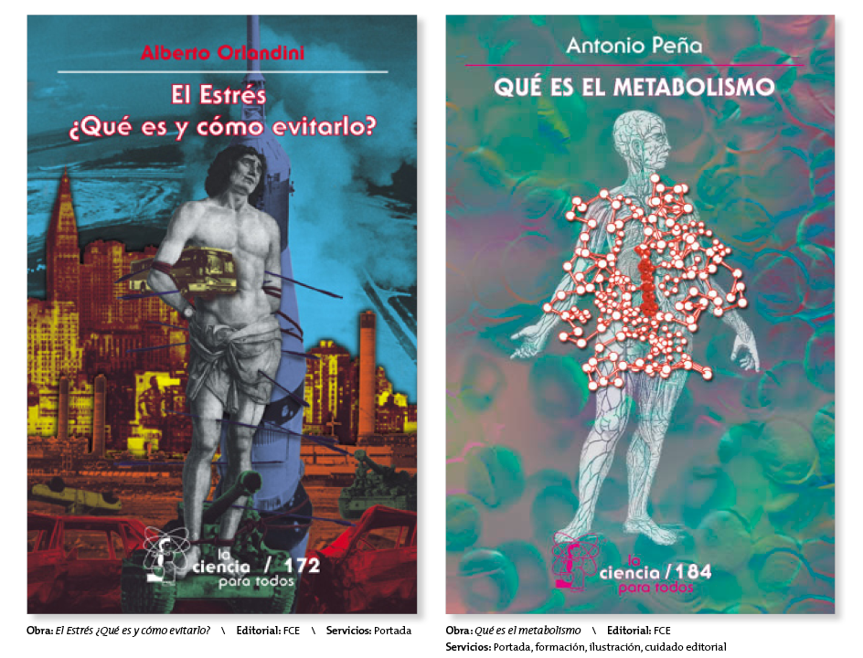

## Portafolio

Selección de trabajos del portafolio

  <h2>Portadas</h2>
  
Hacer clic en las imágenes para ampliarlas

  

    
  

  

    
  

  

    
  

  &times;
  

    
  

---

Descargar el cv y portafolio completo:

- [Alta resolución (40 MB)](link1)
- [Baja resolución (20 MB)](link2)

[(Regresar)](https://ovisnigra.github.io/cv_sbourguet/)
